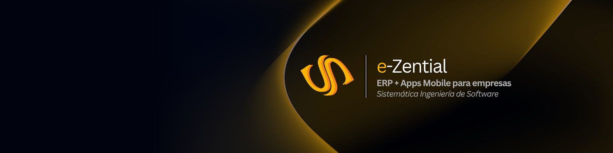

  

# Sistemática Ingeniería de Software

**Soluciones de software para empresas argentinas.**

Desarrollamos **e-Zential**, un ERP modular orientado a la gestión integral de empresas, junto con aplicaciones móviles, integraciones cloud y soluciones de análisis de información para acompañar procesos administrativos, comerciales, logísticos y operativos.

---

## Nuestras soluciones

### e-Zential ERP

Sistema de gestión integral para administrar procesos centrales de la empresa:

- Facturación
- Stock
- Compras y proveedores
- Ventas y cuentas corrientes
- Movimientos de fondos
- Bancos
- Contabilidad
- Logística
- Informes de gestión

### Apps mobile

Aplicaciones móviles integradas con e-Zential para digitalizar procesos comerciales, logísticos y operativos.

### Cloud y Azure

Infraestructura cloud para ERP, file server y aplicaciones empresariales.

### Power BI

Dashboards e informes conectados a datos empresariales para mejorar el análisis y la toma de decisiones.

---

## Contacto

Sitio web: [https://sistematica.com.ar](https://sistematica.com.ar)  
LinkedIn: [Sistemática IS](https://www.linkedin.com/company/sistematica-is/)  
Email: [info@sistematica.com.ar](mailto:info@sistematica.com.ar)  
Ubicación: Rosario, Santa Fe, Argentina
